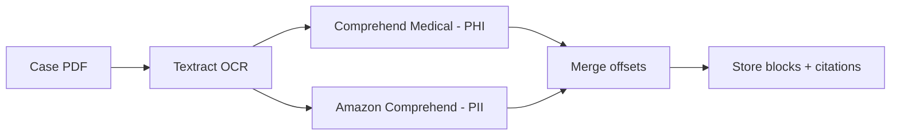
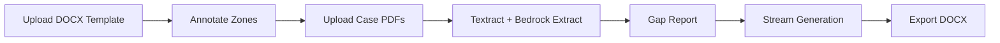

# Demo Run Book — Steno

**Audience**: Personal injury attorneys, law firm administrators, product investors
**Duration**: 2–3 minutes
**Last updated**: 2026-07-01

---

## Setup (pre-demo, do not narrate)

- [ ] Start the full stack: `make dev` (Docker + Express API on :3000, Vite web on :5173)
- [ ] Open browser to `http://localhost:5173`
- [ ] Log in with a demo account
- [ ] Pre-load a job that has a template already annotated and case documents already uploaded, so the gap report is ready
- [ ] Have a fresh job ready for the upload demo (or skip Step 1 and jump straight to Step 2)
- [ ] Keep a sample `.docx` demand letter template and a `.pdf` medical-records file on the desktop

---

## Script

### Hook *(~15 s)*

> Personal injury attorneys spend hours manually drafting demand letters — copying dates and diagnosis codes out of medical records, formatting everything to match the firm's template, and then re-reading the whole thing for errors. Steno automates every repetitive part of that pipeline while keeping the attorney in control of every fact.

---

### Step 1 — Upload a Template *(~20 s)*

**Action**: Click **New Demand Letter** → drag-and-drop the `.docx` template onto the upload zone → click **Upload Template & parse**.

> The attorney uploads their own firm template — a Word file they already use. Steno parses it, identifies every variable slot, and routes you directly into the annotation flow.

**Expected result**: Progress banner ("Uploading & parsing…") resolves; browser navigates to the Annotate page showing a list of detected zones.

---

### Step 2 — Annotate Template Zones *(~25 s)*

**Action**: Scroll the zone list. Show a few "boilerplate-verbatim" zones (greyed out, no input needed) and a few "variable-populated" zones (field name pre-filled by AI). Optionally correct one field name.

> This is the one-time setup step. Steno's AI pre-labels every paragraph as either boilerplate — text that must be copied letter-perfect — or a variable slot. The attorney confirms or corrects the field names. Once saved, that template is reused for every future demand letter from this firm.

**Expected result**: Zone cards show AI-suggested field names; "boilerplate" zones show a locked badge; header/footer zones show "Header (all pages)" / "Footer (all pages)" badges.

---

### Step 3 — Gap Report: AI Reads the Case File *(~35 s)*

**Action**: Switch to the pre-loaded job → click **Gap Report** in the workflow stepper. Show the coverage table. Point to the citation sidebar — click one citation chip to highlight the source block.

> The attorney uploads the medical records and case files as PDFs — but a scanned PDF is just pixels, not text. So first, AWS Textract runs OCR — optical character recognition — turning every page image into machine-readable text, with page numbers and bounding boxes preserved. That text then flows through two AWS-native scrubbers: Comprehend Medical tags the 18 HIPAA PHI identifiers, and Amazon Comprehend catches general PII. Only then does Claude on Bedrock extract the case facts. Every step runs inside the attorney's own AWS account, so PHI never leaves the firm's infrastructure, and every extracted value links back to the exact page it came from.

**Expected result**: Gap report table shows `X of Y slots covered`; green rows for filled fields, red ✗ for gaps; clicking a citation chip scrolls to the source text block below.

**Behind the scenes** (mention only if asked): The OCR → detect → merge → store chain lives in `sns-textract-completion.ts`. It is **fail-closed** — if PHI/PII detection throws on any block, that block is dropped rather than stored unscrubbed. Attorneys see full text for the citation flow; every other viewer gets the tokenized (redacted) version.

---

### Step 4 — Fill a Gap and Generate *(~30 s)*

**Action**: Type a value into one of the empty gap rows (e.g. a demand amount). Click **Proceed to Generate**. On the Generate page, watch the streaming progress as zone content appears.

> For any gap the AI couldn't fill from the documents — say, the negotiated demand amount — the attorney types it in. Then one click triggers generation. Watch as Steno streams the letter section by section, filling each variable zone with the real case facts while leaving every boilerplate clause exactly as the firm wrote it.

**Expected result**: Zone cards populate in real-time; status banner updates ("Generating zone 3 of 8…"); document preview renders the finished letter when streaming completes.

---

### Step 5 — AI Refinement Chat *(~20 s)*  *(Power feature)*

**Action**: In the right-hand **Refinement Panel**, type an instruction (e.g. "Strengthen the medical narrative section — the soft-tissue injuries were severe"). Change scope to **medical_narrative**. Click **Refine**. Toggle **Show diff**.

> Here's where Steno goes beyond templates. After generation the attorney can chat with the document — targeted rewrites to any section, scoped so only that section changes. The diff view shows exactly what changed, and a one-click Accept or Reject keeps the attorney in full control.

**Expected result**: Streaming response appears in the panel; toggling diff shows coloured insert/delete lines; clicking **Accept** updates the document preview in the left column.

---

### Step 6 — Export to Word *(~10 s)*

**Action**: Click **Download DOCX** on the Generate page (or **Open in Editor** → **Export to Word**).

> The finished letter downloads as a standard `.docx` file — compatible with Word, editable, ready to send.

**Expected result**: File downloads as `demand-letter.docx`.

---

### Wrap *(~15 s)*

> In under three minutes, Steno took a blank template and a stack of medical records and produced a firm-quality demand letter with every fact cited, every boilerplate clause intact, and a full audit trail. Check the repo or reach out to learn more.

---

## Timing Guide

| Section | Target |
|---------|--------|
| Hook | 15 s |
| Step 1 — Upload template | 20 s |
| Step 2 — Annotate zones | 25 s |
| Step 3 — Gap report + citations (OCR + scrubbing) | 35 s |
| Step 4 — Fill gap + generate (streaming) | 30 s |
| Step 5 — AI refinement chat (power feature) | 20 s |
| Step 6 — Export DOCX | 10 s |
| Wrap | 15 s |
| **Total** | **~170 s (~2 min 50 s)** |

---

## Contingency Notes

- **If the API is slow to start**: The gap report will show "Preparing documents…" with an auto-retry banner — explain this is the Textract pipeline warming up (can take 30–60 s on first doc).
- **If streaming hangs**: Click **Generate Demand Letter** button manually to re-trigger; the stream reconnects automatically.
- **If the WebSocket collaboration banner appears**: Explain real-time multi-attorney editing requires the deployed WS server; the export flow still works fully.
- **If asked about PHI safety**: "All AI inference runs on Bedrock inside your own AWS account. Before any OCR'd text is stored or logged, we run it through Comprehend Medical (18 HIPAA PHI identifiers) and Amazon Comprehend (general PII), merge the offsets, and redact. It's fail-closed — a detection error drops the block rather than storing it unscrubbed."
- **If asked "what is OCR / how do you read a scanned PDF?"**: "A scanned PDF is an image, not text. AWS Textract runs OCR — optical character recognition — to convert each page image into machine-readable text, preserving page numbers and layout so we can cite the source. It also parses tables and forms, not just plain paragraphs."
- **If asked about template lock-in**: "The attorney annotates once per template. Every future matter using that template goes straight to the gap report — the annotation step is skipped."
- **If asked about loops/tables**: "The template supports native docxtemplater loops for itemised specials tables and conditional clauses for optional sections like liens."
