<!-- _class: lead -->
<!-- _paginate: false -->

# Steno

#### AI-powered demand letter generation for personal injury attorneys

---

## The problem attorneys face every day

- Medical records arrive as **PDF stacks** — hundreds of pages, no structure
- Attorneys manually extract dates, diagnoses, and dollar amounts
- Every demand letter starts from scratch, even with the same firm template
- A single missed fact can **undermine the claim**

> Hours of copy-paste work before the first sentence is written.

<!--
Speaker note: Set the stage. Attorneys aren't AI sceptics — they're drowning in paperwork. Steno targets that specific pain.
-->

---

<!-- _class: lead -->
<!-- _backgroundColor: #161b22 -->

# The Steno Pipeline

### From blank template to finished DOCX in minutes

<!--
Speaker note: Transition into the workflow overview.
-->

---

## Five-step workflow

| Step | Page | What happens |
|------|------|--------------|
| 1 | Template | Upload the firm's `.docx` template |
| 2 | Annotate | AI labels zones; attorney confirms |
| 3 | Gap Report | AI extracts facts from case PDFs |
| 4 | Generate | Claude streams the demand letter live |
| 5 | Export | Download a Word-ready `.docx` |

<!--
Speaker note: Each step is a page in the app. The workflow stepper shows progress at the top of every page.
-->

---

## Step 1 — Upload a firm template

- Drag-and-drop a **standard `.docx`** the firm already uses
- Steno parses the OOXML structure — never flattens to plain text
- Immediately routes to the Annotate page

> Any Word file the firm already has works — no reformatting required.

<!--
Speaker note: Emphasise zero lock-in. The firm keeps their own template. Steno reads it, not replaces it.
-->

---

## Step 2 — Annotate template zones

- AI pre-labels every paragraph: **boilerplate-verbatim** or **variable-populated**
- Attorney reviews each zone and confirms (or corrects) the field name
- Header and footer zones tracked separately per page variant
- **One-time setup** — every future job reuses the same annotation

> Cal. Civ. Code §1431.2 citations stay byte-perfect. The AI never touches boilerplate.

<!--
Speaker note: This is the human gate. The attorney is the accountable party on legal text. The AI does the tedious first pass; the attorney makes the legal boundary call.
-->

---

## Step 3 — Gap Report: AI reads the case file

- Case PDFs processed via **AWS Textract + Claude on Bedrock**
- All inference runs **inside the firm's own AWS account** — PHI never leaves
- Each extracted value links to its **exact source page**
- Missing slots highlighted in red; filled slots shown in green

<!--
Speaker note: Click a citation chip in the demo to scroll to the source text block. This is the provenance story — attorneys can verify every fact.
-->

---

## First, OCR: a scanned PDF is just pixels

- A scanned medical record is an **image**, not text
- **AWS Textract** runs OCR — optical character recognition — turning each page image into machine-readable text
- Page numbers and bounding boxes are preserved, so every fact can be **cited to its source**
- Textract also parses **tables and forms**, not just paragraphs

> You can't detect PHI — or extract a fact — until the page is text.

<!--
Speaker note: This is the very first link in the chain. Image → text → scrub → extract. Without OCR none of the downstream steps have anything to read.
-->

---

## Then scrub: PHI and PII before anything is stored

- **Comprehend Medical** tags the 18 HIPAA PHI identifiers
- **Amazon Comprehend** catches general PII (names, email, SSN)
- Offsets are **merged**, then text is redacted with typed tokens
- **Fail-closed**: a detection error drops the block, never stores it unscrubbed

<!--
Speaker note: This whole OCR → detect → merge → store chain lives in sns-textract-completion.ts. Attorneys see full text for citations; every other viewer gets the redacted version.
-->

---

## The full pipeline, end to end

1. **Template** — upload the firm's DOCX
2. **Annotate** — AI labels zones, attorney confirms
3. **Case PDFs** — upload medical records
4. **Textract + Bedrock** — OCR, scrub, extract
5. **Gap Report** — coverage + live citations
6. **Generate** — stream the letter zone by zone
7. **Export** — download a Word-ready DOCX

<!--
Speaker note: Show the architecture flow: template → annotate → PDFs → Textract/Bedrock → gap report → generate → export. All AWS-native, no third-party PHI exposure.
-->

---

## Step 4 — Streaming generation

- One click triggers **Claude on Bedrock** to fill every variable zone
- Content streams **zone by zone** in real-time — watch the letter build
- Boilerplate zones are copied verbatim — **never routed through the LLM**
- Inline **DOCX preview** renders the finished letter immediately

<!--
Speaker note: The streaming UX is the "wow" moment. Progress banner shows which zone is being generated. Document preview loads from the rendered DOCX when complete.
-->

---

## Step 5 — AI Refinement Chat *(power feature)*

- Post-generation **chat panel** for targeted rewrites
- Scoped to specific sections: `medical_narrative`, `damages`, `liability`, `demand_amount`
- **Diff view** shows exactly what changed — red deletions, green insertions
- One-click **Accept** or **Reject** per refinement — full history preserved

> "Strengthen the soft-tissue narrative — injuries were severe."

<!--
Speaker note: This is what separates Steno from a mail-merge tool. The attorney stays in conversation with the document after generation.
-->

---

## Step 5 (continued) — Rich text editor

- **TipTap editor** for final manual polish
- **Real-time collaborative editing** via WebSocket + Yjs — multiple attorneys simultaneously
- **Track Changes** with per-change accept/reject audit trail
- **Export to Word** from the editor at any point

<!--
Speaker note: The editor is the last mile — for attorneys who want direct control after AI generation.
-->

---

## Step 6 — Export

- **Download DOCX** directly from the Generate page
- Or: Open in Editor → make manual edits → **Export to Word**
- Output is a standard `.docx` — opens in Microsoft Word, no plugins

<!--
Speaker note: Nothing proprietary in the output. The firm owns the file.
-->

---

## Security & compliance

| Concern | How Steno addresses it |
|---------|------------------------|
| PHI in inference | Claude runs on **Bedrock in-account** — PHI stays inside firm's AWS |
| PHI in OCR'd text | **Comprehend Medical** tags 18 HIPAA identifiers before storage |
| PII in OCR'd text | **Amazon Comprehend** tags general PII (names, email, SSN) |
| Detection failure | **Fail-closed** — the block is dropped, never stored unscrubbed |
| Data at rest | KMS-backed RDS + S3 SSE-KMS |

<!--
Speaker note: Law firms ask about HIPAA first. The answer is: all AI inference is on Bedrock, in their account. OCR'd text is scrubbed by two AWS-native services before it's ever stored or logged, and it's fail-closed. No third-party LLM API calls with patient data.
-->

---

<!-- _class: lead -->
<!-- _backgroundColor: #0d1117 -->

## From blank template to finished DOCX

### Under three minutes. Every fact cited. Every clause intact.

<!--
Speaker note: Closing beat — bring it back to the headline promise.
-->

---

<!-- _class: lead -->
<!-- _paginate: false -->

# Questions?

#### Reach out or check the repo to learn more.

<!--
Speaker note: Open the floor. Common questions: template lock-in, PHI handling, docxtemplater loops for specials tables, real-time collab setup.
-->
