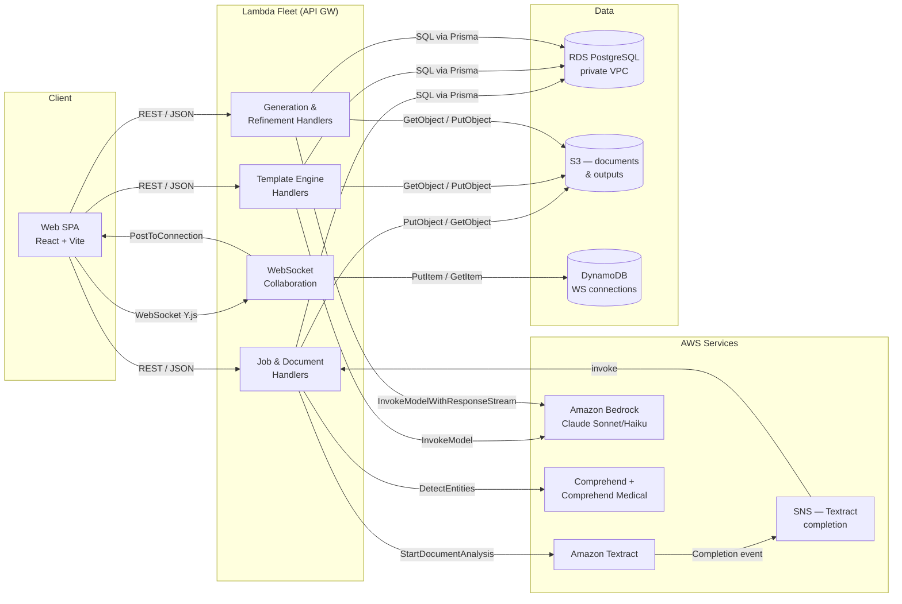
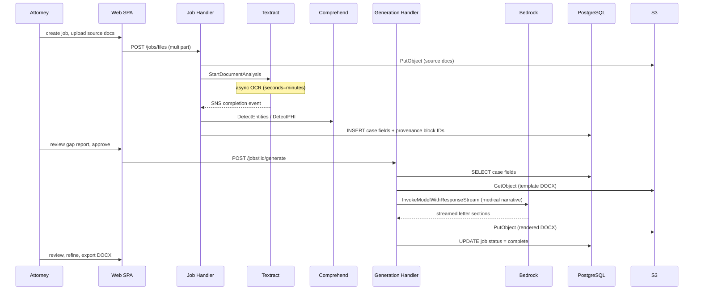

# Demand Letter Generator

An AI-assisted legal document platform that extracts structured case data from medical and accident records, then generates HIPAA-compliant personal-injury demand letters as attorney-editable DOCX files.

**Repository:** https://github.com/codewizard-dt/demand-letter

> **Quick links:** [Testing guide](TESTING.md) · [AI usage log](AI_USAGE.md)

## Description

The Demand Letter Generator automates the most time-consuming parts of personal-injury demand letter drafting. Attorneys upload case documents (medical records, accident reports, bills), and the platform extracts ~40 structured fields — each with Textract block-level provenance — using a hybrid OCR + LLM pipeline. A template engine then fills a pre-approved DOCX template and delivers a fully formatted letter that the attorney can review and refine in a rich-text editor.

PHI and PII handling is a first-class concern: every document processed through the system is scrubbed via AWS Comprehend Medical + Comprehend before any data leaves the pipeline. The product deliberately runs Claude on Amazon Bedrock so protected health information never leaves the AWS HIPAA boundary.

The target users are personal-injury law firms handling high-volume cases who want to accelerate the demand-letter authoring cycle without sacrificing the accuracy or tone control that malpractice risk requires. The attorney remains in the loop at every meaningful gate: zone classification is LLM-seeded but attorney-confirmed, and generated letter sections can be refined in a tracked-changes-style editor with accept/reject semantics.

## Architecture

### Overview

The system is a **serverless monorepo** deployed on AWS SAM: a React + Vite SPA (hosted on AWS Amplify) talks to a fleet of Node.js Lambda functions through API Gateway REST and WebSocket endpoints. Persistent state lives in an RDS PostgreSQL instance (in a private VPC) and an S3 bucket for source documents and rendered DOCX outputs. All AI inference (zone classification, field extraction, letter generation, proofreading) routes through Amazon Bedrock.

### Components

#### Web Frontend

- **Responsibility:** SPA that guides attorneys through job creation, document upload, gap-report review, letter editing, and DOCX export.
- **Tech:** React 18, TypeScript, Vite, TipTap (ProseMirror), Yjs, React Router v6, TanStack Query
- **Inputs:** User actions (form submissions, file uploads, editor events), WebSocket messages from the collaboration server
- **Outputs:** REST API calls to Lambda, Y.js document updates over WebSocket
- **Depends on:** Lambda API Gateway (REST), Lambda WebSocket API, S3 (presigned URLs for upload/download)

#### Lambda API — Job & Document Handlers

- **Responsibility:** REST endpoints for job lifecycle: create, list, file upload, document ingest (triggers Textract), gap-report fetch, generation, refinement, and template management.
- **Tech:** Node.js 24.x, TypeScript, Express (local dev), AWS SAM (production); ~20 Lambda handlers
- **Inputs:** API Gateway HTTP events (REST), multipart form data, DOCX binary uploads
- **Outputs:** JSON responses, S3 object writes, RDS row mutations, SNS publish (Textract completion)
- **Depends on:** RDS PostgreSQL (Prisma), S3, Amazon Textract, Amazon Bedrock, AWS Comprehend / Comprehend Medical

#### Lambda API — Template Engine

- **Responsibility:** Zone classification (LLM-seeded, attorney-confirmed), delimiter injection, DOCX generation via docxtemplater, system-field injection (page numbers, dates), literal replacements, and PHI-scrubbed DOCX preview.
- **Tech:** Node.js 24.x, docxtemplater, pizzip, mammoth; handlers: `post-jobs-templates-classify`, `post-jobs-templates-inject`, `post-jobs-templates-segment`, `patch-jobs-template-zones`
- **Inputs:** DOCX template binary from S3, zone classification JSON from attorney
- **Outputs:** Annotated DOCX template persisted to S3, zone metadata in RDS
- **Depends on:** S3, Amazon Bedrock (Claude Sonnet / Haiku), RDS

#### Lambda API — Generation & Refinement Engine

- **Responsibility:** Assembles the docxtemplater data payload from extracted fields, runs the medical narrative LLM pass, inserts body images, proofreads, and streams the final DOCX back.
- **Tech:** Node.js 24.x, docxtemplater, AWS SDK v3 Bedrock streaming; handlers: `post-jobs-generate`, `post-jobs-refine`, `get-jobs-output`, `get-jobs-output-docx`
- **Inputs:** Job record + extracted case fields from RDS, template DOCX from S3
- **Outputs:** Rendered DOCX to S3, WebSocket progress events, status transitions in RDS
- **Depends on:** RDS, S3, Amazon Bedrock, WebSocket API Gateway

#### WebSocket Collaboration Server

- **Responsibility:** Relays Y.js document updates between browser tabs for real-time collaborative editing of the generated letter.
- **Tech:** Node.js 24.x, Yjs, `y-websocket`, API Gateway WebSocket API; handler: `ws-connect`/`ws-message`/`ws-disconnect`
- **Inputs:** WebSocket `$connect` / `$disconnect` / `$default` route events
- **Outputs:** Broadcast to connected clients via `@aws-sdk/client-apigatewaymanagementapi`, DynamoDB connection registry
- **Depends on:** DynamoDB (connection table), API Gateway WebSocket

#### PHI/PII Scrubbing Layer

- **Responsibility:** Runs extracted text through Comprehend Medical (PHI) and Comprehend (PII) to produce typed, offset-annotated redaction tokens before any data is persisted or sent to the LLM.
- **Tech:** Node.js 24.x, `@aws-sdk/client-comprehend`, `@aws-sdk/client-comprehendmedical`; lib modules: `redact-text`, `merge-entities`
- **Inputs:** Raw OCR text from Textract
- **Outputs:** Redacted text + offset map (passed to field extraction and generation)
- **Depends on:** AWS Comprehend, AWS Comprehend Medical

#### RDS PostgreSQL (Prisma)

- **Responsibility:** Stores jobs, case fields (with Textract block IDs as provenance), template zone metadata, LLM audit logs (token counts + cost), and WebSocket connection records.
- **Tech:** PostgreSQL 16.14 (RDS db.t4g.micro, encrypted at rest with KMS CMK), Prisma ORM, private VPC subnets
- **Inputs:** SQL from Lambda functions via Prisma Client
- **Outputs:** Relational records queried by API handlers

#### S3 Document Store

- **Responsibility:** Durable storage for source document uploads, template DOCX, rendered output DOCX, and preview HTML.
- **Tech:** S3 (KMS-encrypted, versioned, HTTPS-only bucket policy), Intelligent-Tiering lifecycle for `output/` prefix
- **Inputs:** Presigned PUT from browser, direct Lambda PutObject
- **Outputs:** Presigned GET URLs for browser download, Lambda GetObject for processing

### Component Interaction



### Data Flow



### Design Decisions

- Zone labels are LLM-seeded but persisted as deterministic OOXML delimiter markup after attorney confirmation — boilerplate must never be paraphrased because silent rephrasing is malpractice-grade failure. ([DEC-0001](wiki/work/decisions/DEC-0001.md))
- Claude runs on Amazon Bedrock (not the public API) so PHI never leaves the AWS HIPAA account boundary. ([DEC-0003](wiki/work/decisions/DEC-0003.md#D2))
- docxtemplater fills delimiter-tagged DOCX slots with a fail-closed `nullGetter` — missing fields halt generation rather than producing a letter with blank sections. ([DEC-0002](wiki/work/decisions/DEC-0002.md))
- PHI scrubbing uses Comprehend Medical + Comprehend in tandem (merged offset map) so both clinical entities and general PII (names, SSNs) are caught before text reaches the LLM. ([DEC-0004](wiki/work/decisions/DEC-0004.md))
- Every Bedrock call writes an `LlmAuditLog` row (token counts, model, estimated cost) so AI spend is attributable per job, surfaced in the admin dashboard.
- Field extraction cites Textract block IDs as provenance on every extracted value, enabling human verification of "where did the AI get this?"

## Technologies

**Languages & Runtimes**
- TypeScript (strict mode, flat ESLint config) — monorepo-wide
- Node.js 24.x — Lambda runtime and local dev server

**Frontend**
- React 18 + React Router v6
- Vite (bundler + dev server)
- TipTap 3 / ProseMirror — rich-text editor with custom read-only zone plugin
- Yjs + y-prosemirror + y-websocket — real-time collaborative editing (CRDTs)
- TanStack Query v5 — server-state management
- docx-preview + mammoth — in-browser DOCX rendering
- lucide-react — icons

**Backend / API**
- AWS SAM (Serverless Application Model) — Lambda + API Gateway infrastructure-as-code
- Express 4 — local dev server (mirrors SAM event shape)
- docxtemplater + pizzip — DOCX template filling
- docx 9 — programmatic DOCX manipulation (system fields, body images)
- mammoth — DOCX → HTML for preview
- pdf-parse + pdfjs-dist — PDF text extraction
- busboy + lambda-multipart-parser — multipart file upload parsing
- fast-xml-parser — OOXML manipulation

**Database & ORM**
- PostgreSQL 16.14 (AWS RDS db.t4g.micro)
- Prisma ORM 5 — schema, migrations, typed client

**AWS Services**
- Amazon Bedrock (Claude Sonnet 4.5 / Haiku 4.5) — zone classification, field extraction, letter generation, proofreading
- Amazon Textract — OCR + structured document analysis
- AWS Comprehend + Comprehend Medical — PHI/PII entity detection and redaction
- API Gateway (REST + WebSocket)
- S3 (KMS-encrypted, versioned)
- DynamoDB — WebSocket connection registry
- SNS — async Textract completion notifications
- AWS SSM Parameter Store — secrets management (DB credentials, Bedrock model IDs)
- AWS KMS — CMK for RDS and S3 encryption
- AWS Amplify — frontend CI/CD and hosting

**Tooling**
- pnpm workspaces (monorepo)
- Vitest — unit + integration tests (22 files, 143 cases)
- Playwright — E2E browser tests (6 spec files)
- aws-sdk-client-mock + vitest-mock-extended — AWS SDK v3 and Prisma mocking

## Use Cases

- **High-volume PI law firms** — attorneys who process dozens of demand letters per month and need to eliminate the hours-long manual data-extraction step while retaining full control over the final document.
- **HIPAA-compliant document automation** — any legal or medical-adjacent workflow that requires LLM assistance on PHI-containing documents and cannot use a third-party API that stores data outside a BAA boundary.
- **Template-driven legal document generation** — firms with established letter templates that need structured data injected at defined zones without altering boilerplate language.
- **Collaborative legal document review** — multi-attorney teams who need real-time co-editing of AI-generated drafts with tracked-changes-style accept/reject refinement.

## Skills Demonstrated

- **Serverless Architecture Design (AWS SAM / Lambda / API Gateway)** — designed and deployed a fleet of ~20 Lambda functions behind REST and WebSocket API Gateway endpoints, with VPC-isolated RDS access and SNS-triggered async processing.
- **AI/LLM Integration (Amazon Bedrock, Claude)** — integrated Claude Sonnet and Haiku via Bedrock streaming for zone classification, medical narrative generation, and proofreading; implemented token-cost audit logging per invocation.
- **PHI/PII Compliance Engineering (HIPAA, AWS Comprehend)** — built a fail-closed PHI scrubbing pipeline using Comprehend Medical + Comprehend with offset-merged entity maps and compliance smoke tests.
- **Document Processing Pipeline (Textract, docxtemplater, OOXML)** — implemented hybrid OCR-to-LLM extraction with Textract block-level provenance citations and DOCX template filling with fail-closed null guards.
- **Real-Time Collaborative Editing (Yjs, CRDTs, WebSocket)** — wired Y.js CRDT document sync over API Gateway WebSocket with DynamoDB connection registry and a custom TipTap ProseMirror plugin for read-only zone enforcement.
- **Database Schema Design (Prisma ORM + PostgreSQL)** — designed a normalized schema tracking jobs, extracted case fields with provenance, zone metadata, and LLM audit logs; managed via Prisma Migrate.
- **Infrastructure as Code (AWS SAM / CloudFormation)** — authored a full SAM template covering RDS, S3 (KMS-encrypted), VPC networking (private subnets, security groups), Lambda layers, and SSM-resolved secrets.
- **TypeScript Monorepo Architecture (pnpm workspaces)** — structured a strict-TypeScript monorepo with shared `@demand-letter/db` package, type-aware ESLint flat config, and cross-package typecheck/lint CI.
- **Test-Driven API Development (Vitest, aws-sdk-client-mock)** — built a three-layer test strategy: 137 unit tests (AWS + Prisma mocked), 4 real-service integration tests, and 54-case LLM golden-set evals with regression tracking.
- **Agentic AI-Assisted Development Workflow** — used Claude Code with a custom skill library (research → decision → roadmap → task → UAT pipeline) to build 118 tasks across 10 roadmaps with an append-only audit log; maintained human-in-the-loop gates at every architecture decision.

## Deployment

### Overview

The backend deploys as an AWS SAM stack (Lambda + API Gateway + RDS + S3) via `sam deploy` into AWS account `429842292480`, region `us-east-1`. The frontend is a static Vite build hosted on AWS Amplify (CI triggered by git push). Deploys are currently manual (`sam deploy`) for the backend and GitOps (Amplify) for the frontend.

### Prerequisites

- **Node.js 24.x** (`engines` constraint in `package.json`)
- **pnpm 9** (`corepack enable && corepack prepare pnpm@9 --activate`)
- **AWS CLI v2** configured with access to account `429842292480`, region `us-east-1`
- **AWS SAM CLI** (`brew install aws-sam-cli` or equivalent)
- **Docker** (required by `sam build` for Lambda packaging)
- AWS account with Bedrock model entitlements enabled for `claude-sonnet-4-5` and `claude-haiku-4-5` in `us-east-1` (must be enabled manually in the Bedrock console)
- An existing VPC with two private subnets and a configured SNS topic ARN for Textract completion notifications

### Environment Variables

| Variable | Required | Example | Description |
|---|---|---|---|
| `DATABASE_URL` | yes | `postgresql://postgres@localhost:5430/demand_letter_dev` | Prisma + host-tool DB connection (dev: Docker port mapping) |
| `BEDROCK_MODEL_ID_LOGIC` | yes | `us.anthropic.claude-sonnet-4-5-20250929-v1:0` | Bedrock model for zone classification and generation |
| `BEDROCK_MODEL_ID_BASIC` | yes | `us.anthropic.claude-haiku-4-5-20251001-v1:0` | Bedrock model for lightweight passes (proofreading, etc.) |
| `AWS_REGION` | yes | `us-east-1` | AWS region for all SDK clients |
| `AWS_SDK_LOAD_CONFIG` | yes | `1` | Load credentials from `~/.aws/config` |
| `AWS_EC2_METADATA_DISABLED` | yes | `true` | Disable EC2 metadata endpoint (required for local SAM) |
| `DOCUMENTS_BUCKET` | yes | `dev-demand-letter-docs-429842292480` | S3 bucket for source docs, templates, and output DOCX |
| `STAGE` | yes | `dev` | Stack stage (`dev` / `staging` / `prod`) |
| `VITE_WS_API_URL` | yes (frontend) | `wss://xxx.execute-api.us-east-1.amazonaws.com/prod` | WebSocket API URL for Y.js collaboration |
| `API_BASE_URL` | no | `http://127.0.0.1:3000` | Used by UAT/test scripts; not needed in Lambda |

In production, `DATABASE_URL` is injected via SSM Parameter Store (`/${Stage}/demand-letter/db/url`) resolved at deploy time. Seed SSM parameters before the first `sam deploy`:

```bash
STAGE=prod AWS_REGION=us-east-1 bash scripts/setup-ssm.sh
```

### Build

```bash
# Install dependencies
pnpm install --frozen-lockfile

# Type-check all packages
pnpm typecheck

# Compile Lambda handlers (outputs to .build/)
sam build --cached --parallel
```

The SAM build bundles the `@demand-letter/db` Prisma layer into `app/db/` and compiles each handler's TypeScript under `.build/handlers/`.

### Run Locally

```bash
# 1. Start local Postgres (Docker)
docker compose up -d postgres

# 2. Apply Prisma migrations
pnpm --filter @demand-letter/db migrate:dev

# 3. Start the SAM local API (uses env.json for Lambda env vars)
sam local start-api --port 3000

# 4. Start the Vite frontend dev server
pnpm --filter @demand-letter/web dev
# → http://localhost:5173

# 5. (Optional) Start the Y.js WebSocket server for collaboration
pnpm --filter @demand-letter/server dev:ws
```

The SAM local server maps Lambda handler events to `http://127.0.0.1:3000` using the Docker network `demand-letter-dev` so Lambda containers can reach the `postgres` service by hostname.

### Deploy

1. **Seed SSM secrets** (first time per stage):
   ```bash
   STAGE=prod bash scripts/setup-ssm.sh
   ```
2. **Build the SAM stack**:
   ```bash
   sam build --cached --parallel
   ```
3. **Deploy to AWS**:
   ```bash
   sam deploy \
     --stack-name demand-letter \
     --capabilities CAPABILITY_IAM \
     --region us-east-1 \
     --parameter-overrides \
       Stage=prod \
       VpcId=vpc-05d675a56f47ef466 \
       PrivateSubnet1=subnet-05925fc8ff290a62c \
       PrivateSubnet2=subnet-027279b7af8e18cf9 \
       WebAppOrigin=https://main.d2qz3c6ux2u72z.amplifyapp.com \
       WebAppOrigin2=https://main.d2qz3c6ux2u72z.amplifyapp.com \
       TextractCompletionTopicArn=arn:aws:sns:us-east-1:429842292480:demand-letter-prod-textract-completion
   ```
4. **Frontend** — AWS Amplify CI/CD triggers automatically on `git push` to `main` via `amplify.yml`. The Amplify app root is `app/frontend`; builds run `pnpm build` and deploy `dist/`.

### Data & Migrations

Migrations are managed by Prisma Migrate. The migration history lives in `packages/db/prisma/migrations/`.

```bash
# Apply pending migrations (development)
pnpm --filter @demand-letter/db migrate:dev

# Apply migrations in production (run against prod DATABASE_URL)
pnpm --filter @demand-letter/db migrate:deploy
```

Migrations must be run manually after each `sam deploy`. The RDS instance has `DeletionPolicy: Retain` so a stack delete does not drop the database. Rollback requires a manual `prisma migrate resolve --rolled-back <migration>` followed by a corrective migration.

### Health Checks & Smoke Tests

```bash
# List jobs (confirms API Gateway → Lambda → RDS path)
curl https://<api-id>.execute-api.us-east-1.amazonaws.com/prod/jobs

# Run unit tests (no external services needed)
pnpm test:api

# Run PHI compliance smoke test
pnpm --filter @demand-letter/server compliance-verify

# Run LLM evals against live handlers
pnpm evals
```

### Rollback

- **Lambda / API Gateway:** `sam deploy` is idempotent; re-deploy the previous git SHA by checking it out and re-running `sam build && sam deploy`.
- **Database:** Prisma does not auto-rollback migrations. Apply a corrective migration or restore from the most recent RDS automated backup (retention: 7 days).
- **Frontend (Amplify):** Use the Amplify console "Redeploy this version" button on the previous build, or revert the git commit and push.

### Observability

- **Lambda logs:** CloudWatch Logs, one log group per function (`/aws/lambda/<function-name>`).
- **RDS:** Performance Insights enabled on the `db.t4g.micro` instance; CloudWatch metrics for CPU, connections, and free storage.
- **LLM cost tracking:** Every Bedrock call writes an `LlmAuditLog` row (model, input tokens, output tokens, estimated USD). Query via the admin dashboard at `/admin` or directly: `SELECT * FROM "LlmAuditLog" ORDER BY "createdAt" DESC LIMIT 20;`.
- No centralized alerting or distributed tracing is currently configured.

### Troubleshooting

- **`sam local start-api` can't reach Postgres** — Lambda containers use the Docker service hostname `postgres`, not `localhost`. Check `env.json` has `DATABASE_URL=postgresql://postgres@postgres/demand_letter_dev` (not the host-mapped port URL).
- **Bedrock `AccessDeniedException`** — the Bedrock model entitlement for `claude-sonnet-4-5` or `claude-haiku-4-5` is not enabled in this region. Go to the Bedrock console → Model access → enable both models.
- **Textract jobs stuck in `EXTRACTING` status** — the SNS completion topic ARN in the SAM parameters doesn't match the deployed SNS topic, or the Lambda's SNS subscription was not created. Check the `TextractCompletionTopicArn` parameter and the SNS → Subscriptions console.
- **`sam deploy` fails on `DbUrlSsmVersion` resolve** — the SSM parameter `/{Stage}/demand-letter/db/url` doesn't exist yet. Run `scripts/setup-ssm.sh` first.
- **Prisma migration fails on deploy** — the `DATABASE_URL` used for `migrate:deploy` doesn't have `CREATE TABLE` / `ALTER TABLE` privileges. Use the RDS master user for migration runs, not the app user.
- **Frontend shows stale data after deploy** — TanStack Query caches API responses; hard-refresh (`Ctrl+Shift+R`) or invalidate the cache from the query devtools.
