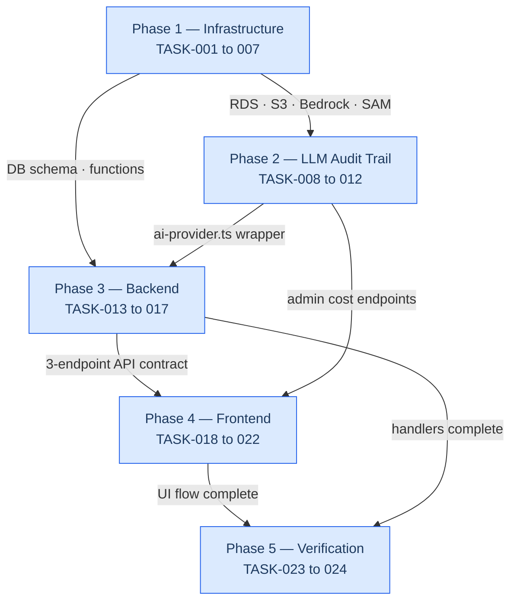
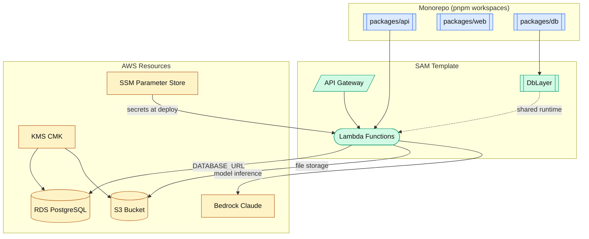
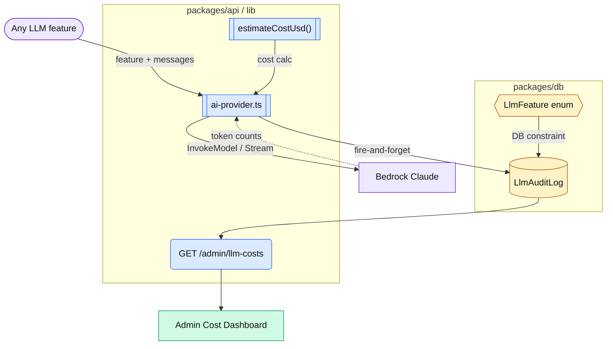
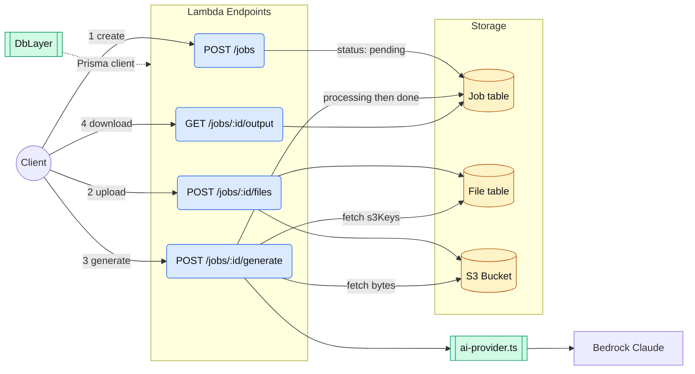
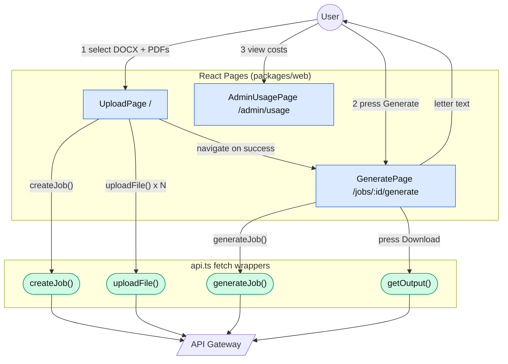
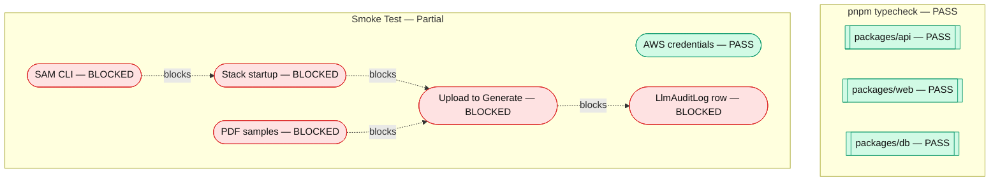

# ROADMAP-001: End-to-End Skeleton — Implementation Guide

ROADMAP-001 is the vertical slice that touches every layer of the stack before any "real" feature is built. Its purpose was to prove the architecture end-to-end: a user uploads a DOCX template and PDF case documents, presses Generate, and receives a Claude-on-Bedrock demand letter in their browser — with cost/usage logged automatically in PostgreSQL. Every subsequent roadmap inherits the audit trail, the job lifecycle model, and the file-storage primitives established here.

See also: relates-to::[[ROADMAP-002-template-ingestion-zone-detection]], relates-to::[[ROADMAP-004-generation-engine]]

---

## How the Phases Fit Together



---

## Phase 1 — Infrastructure

**Goal:** provision and wire the foundational AWS resources with zero application logic.



### What was built

| Task | Deliverable |
|------|-------------|
| TASK-001 | AWS SAM TypeScript monorepo scaffold (`packages/api`, `packages/web`, `packages/db`) |
| TASK-002 | PostgreSQL schema bootstrap — `Job` and `File` Prisma models, initial migration |
| TASK-003 | RDS instance with KMS CMK encryption (HIPAA-eligible storage at rest) |
| TASK-004 | S3 bucket for source documents and generated outputs (server-side KMS encryption) |
| TASK-005 | Bedrock model access — verified Claude inference profile (`us.anthropic.claude-3-5-sonnet-20241022-v2:0`) and smoke-tested a raw API call |
| TASK-006 | Secret management — dotenv for local dev, SSM Parameter Store for deployed environments |
| TASK-007 | TypeScript strict mode + ESLint + Prettier established as the clean baseline |

### Design decisions baked in here

- **Monorepo structure**: three packages share a single `pnpm-lock.yaml`. The `@demand-letter/db` package owns Prisma and exports the singleton `prisma` client and all generated types — no package imports `@prisma/client` directly.
- **KMS CMK on both RDS and S3**: required for HIPAA-eligible storage. The key is created in `template.yaml` and referenced by both resource policies.
- **SAM as the IaC layer**: all Lambda functions, API Gateway routes, and environment variable injections are declared in `template.yaml`. Local dev uses `sam local start-api`.

### How it enables Phase 2

Phase 2 needs a Prisma client and a DB connection. The infrastructure phase guarantees `DATABASE_URL` is resolved from SSM at deploy time, and the Prisma schema is already migrated. Phase 2 only adds models on top.

---

## Phase 2 — LLM Audit Trail

**Goal:** wire cost/usage logging from day one so every subsequent LLM call is automatically tracked.



### What was built

| Task | Deliverable |
|------|-------------|
| TASK-008 | `LlmAuditLog` Prisma model — records `userId`, `feature`, `model`, `provider`, `inputTokens`, `outputTokens`, `estimatedCostUsd` (Decimal, 6 dp), `durationMs`, `createdAt` with indexes on `userId`, `(feature, createdAt)`, and `createdAt` |
| TASK-009 | `MODEL_PRICING` map and `estimateCostUsd(modelId, inputTokens, outputTokens)` utility in `packages/api/src/lib/ai.ts` |
| TASK-010 | `ai-provider.ts` — thin Bedrock wrapper exposing `invokeModel()` and `invokeModelStream()`; records `durationMs` in `finally`, fire-and-forgets `llmAuditLog.create()` (errors swallowed so a failed DB write never breaks the request) |
| TASK-011 | `GET /admin/llm-costs` — Lambda-backed endpoint returning aggregated cost rows from `LlmAuditLog` |
| TASK-012 | `/admin/usage` React page rendering the cost dashboard |

### Key design choices

- **`LlmFeature` enum** constrains which features can appear in the audit table at the DB level. Values: `zone_classification`, `case_extraction`, `medical_narrative`, `refinement`, `skeleton_generation`. Every new roadmap that calls an LLM adds its feature name here.
- **`Decimal` for cost**: avoids float rounding. Stored as `DECIMAL(10, 6)` in PostgreSQL.
- **Fire-and-forget audit writes**: `prisma.llmAuditLog.create(...).catch(() => {})` means a DB outage or permission error never surfaces to the end user. The tradeoff is that some audit rows may be silently lost under failure.
- **`userId` is a plain `String` with no foreign key**: audit rows survive user deletion.

### How it enables Phase 3

Every backend handler in Phase 3 calls `invokeModel()` or `invokeModelStream()` from `ai-provider.ts`. They pass a `feature` enum value and the audit row is written automatically — Phase 3 authors never write logging code.

---

## Phase 3 — Backend

**Goal:** implement the three-endpoint job lifecycle so the frontend has something to call.



### What was built

| Task | Deliverable |
|------|-------------|
| TASK-013 | `POST /jobs` — creates a `Job` row (`status: pending`) and returns `{ id }` (201) |
| TASK-014 | `POST /jobs/:id/files` — receives a `multipart/form-data` upload, stores the file in S3 under `jobs/{jobId}/{filename}`, records a `File` row with `s3Key` and `mimeType` |
| TASK-015 | `POST /jobs/:id/generate` — fetches all files for the job from S3, base64-encodes them as Anthropic document blocks, sends a zero-shot generation prompt to Claude via `invokeModelStream()`, stores the output on the `Job` row, returns the text (200) |
| TASK-016 | `GET /jobs/:id/output` — returns the stored output from the `Job` row |
| TASK-017 | Lambda `DbLayer` (a Lambda Layer containing the Prisma client and engine) wired through `template.yaml` so every function shares a single copy of `node_modules/@prisma` |

### The job lifecycle state machine

```
pending  →  processing  →  done
                ↓
              failed
```

`POST /jobs` creates in `pending`. `POST /jobs/:id/generate` transitions to `processing` at the start of generation and to `done` (with the output stored) on success, or `failed` on error.

### Generation prompt (skeleton stage)

```
Generate a demand letter matching the provided template exactly,
using the case documents as the source of facts.
```

No zone detection, no slot filling, no structured extraction — the skeleton sends everything as document blocks and relies on the model to match the template style. This is intentionally naive; ROADMAP-004 replaces this call with a structured generation pipeline.

### SAM template pattern

Each function resource in `template.yaml` follows the same pattern:

```yaml
FunctionName:
  Type: AWS::Serverless::Function
  Properties:
    Handler: src/handlers/<name>.handler
    Layers: [!Ref DbLayer]
    Environment:
      Variables:
        DATABASE_URL: !Sub '{{resolve:ssm:/${Stage}/demand-letter/db/url}}'
```

The `DbLayer` is critical — it keeps the Prisma binary engine out of each function's deployment zip.

### How it enables Phase 4

Phase 4 needs exactly the three-step API contract: create job → upload files → generate. All three endpoints exist and are registered in `template.yaml` by the end of Phase 3.

---

## Phase 4 — Frontend

**Goal:** build the browser UI for the full user flow: upload → generate → download.



### What was built

| Task | Deliverable |
|------|-------------|
| TASK-018 | Steno.com style audit — extracted a generalised style guide (color palette, typography, spacing, component patterns) to guide the frontend look-and-feel |
| TASK-019 | Tailwind CSS v4 added to `packages/web` (`@tailwindcss/vite` plugin, `@import "tailwindcss"` in `main.css`) |
| TASK-020 | `UploadPage.tsx` — file inputs for DOCX template (single) and PDF case docs (multiple); calls `POST /jobs` then `POST /jobs/:id/files` for each file; navigates to `/jobs/:id/generate` on success |
| TASK-021 | `GeneratePage.tsx` — "Generate" button calls `POST /jobs/:id/generate`; displays the streamed output in a scrollable panel |
| TASK-022 | Download button on `GeneratePage` — calls `GET /jobs/:id/output` and triggers a browser file download |
| TASK-012 | `/admin/usage` cost dashboard (wired from Phase 2; route registered here) |

### Frontend architecture

```
src/
  pages/
    UploadPage.tsx      — route: /
    GeneratePage.tsx    — route: /jobs/:id/generate
    AdminUsagePage.tsx  — route: /admin/usage
  lib/
    api.ts              — typed wrappers: createJob(), uploadFile(), generateJob(), getOutput()
  main.tsx              — Vite + React + react-router-dom entry point
```

`api.ts` reads `VITE_API_URL` from the environment so the same build can point at `sam local` or a deployed API Gateway URL.

### How it enables Phase 5

Phase 5 needs all four pages to exist and the full upload → generate → download path to be wired up before it can run the smoke test.

---

## Phase 5 — Verification

**Goal:** confirm the complete path works end-to-end and the codebase passes typecheck.



### What was built

| Task | Deliverable |
|------|-------------|
| TASK-023 | End-to-End Smoke Test — designed to drive the full path with `curl` and verify the `LlmAuditLog` row; partially blocked by environment gaps (see below) |
| TASK-024 | Final monorepo typecheck gate — `pnpm typecheck` passes across all three packages with zero errors |

### Smoke test results (2026-06-24)

The environment gaps surfaced during Phase 5 are **not blockers for subsequent roadmaps** — they are deployment-environment issues, not code defects.

| Gate | Result | Reason |
|------|--------|--------|
| `pnpm typecheck` | PASS | Zero errors across `api`, `web`, `db` |
| AWS credentials | PASS | `aws sts get-caller-identity` succeeds (account 429842292480) |
| SAM CLI available | BLOCKED | `sam` not installed in this environment; install with `brew install aws-sam-cli` |
| Stack startup | BLOCKED | Requires SAM CLI |
| POST /jobs → POST /jobs/:id/files → POST /jobs/:id/generate | BLOCKED | Requires SAM local stack |
| `LlmAuditLog` row written | BLOCKED | Requires stack; DB reachable, table exists, 0 rows |
| PDF sample files present | BLOCKED | Only the DOCX template is in `raw/`; no PDF case documents |

### Known follow-up items for deployment

1. Install SAM CLI: `brew install aws-sam-cli`
2. Add PDF case documents to `raw/` to test multi-file upload
3. Grant DB user `SELECT` on `LlmAuditLog`: `GRANT SELECT ON "LlmAuditLog" TO <role>;`
4. Note: `LlmAuditLog` uses Prisma camelCase column names in PostgreSQL — use quoted identifiers in `psql` queries (e.g., `"inputTokens"` not `input_tokens`)

---

## What ROADMAP-001 Leaves in Place

At the end of ROADMAP-001, every layer is wired and typecheck-clean:

| Layer | State |
|-------|-------|
| AWS SAM IaC | All five function resources declared in `template.yaml` with DbLayer, SSM-resolved env vars |
| PostgreSQL | `Job`, `File`, `LlmAuditLog` tables migrated; Prisma client generated |
| S3 | Bucket provisioned; `POST /jobs/:id/files` stores to it; `POST /jobs/:id/generate` reads from it |
| Bedrock | Inference profile verified; `ai-provider.ts` wrapper handles both streaming and non-streaming calls with automatic audit logging |
| API | Five endpoints: `POST /jobs`, `POST /jobs/:id/files`, `POST /jobs/:id/generate`, `GET /jobs/:id/output`, `GET /admin/llm-costs` |
| Frontend | Upload → Generate → Download flow complete; `/admin/usage` cost dashboard |
| Cost tracking | Every LLM call from any future feature gets logged automatically via the `ai-provider.ts` wrapper |

---

## What Comes Next

ROADMAP-001 uses a naive, zero-shot generation approach. The remaining roadmaps replace each naive piece with a proper implementation:

| Roadmap | Replaces / Extends |
|---------|--------------------|
| **ROADMAP-002** — Template Ingestion & Zone Detection | Replaces "send template as context" with DOCX parsing → LLM zone classification → attorney annotation UI → docxtemplater delimiter injection. After this, every template has a named slot list. |
| **ROADMAP-003** — Case Record Ingestion & Provenance | Replaces "send PDFs as document blocks" with Textract OCR → structured field extraction → provenance linking. After this, every case record has a typed field map with citations. |
| **ROADMAP-004** — Generation Engine | Replaces the single zero-shot prompt with a template-aware, slot-filling generation pipeline that consumes the zone map (ROADMAP-002) and case record (ROADMAP-003). |
| **ROADMAP-005** — PHI/PII Compliance Layer | Adds Comprehend Medical scrubbing to LLM inputs/outputs and audit logs so no PHI appears in logs or cost rows. |
| **ROADMAP-006** — Attorney Refinement Loop | Adds a review-and-edit UI layer where attorneys can request targeted revisions after the initial generation. |
| **ROADMAP-007** — Collaborative Editing & Word Export | Adds multi-user editing and a DOCX export path that preserves the original template formatting. |

The skeleton's job lifecycle (`pending → processing → done / failed`) and the `LlmAuditLog` table are unchanged through all subsequent roadmaps — they are the stable spine every feature builds on.
