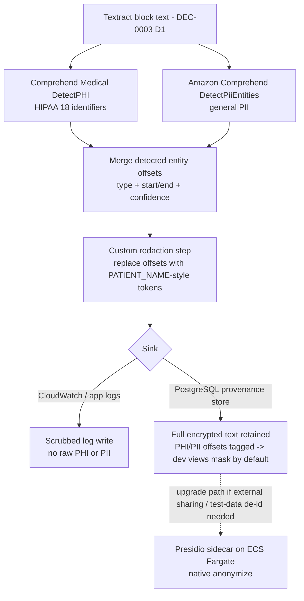

# DEC-0004: PHI/PII Scrubbing Engine

> Decision Group covering which engine detects and redacts PHI + PII in logs and the Textract provenance store (D1).

- **File created**: 2026-06-22
- **Last updated**: 2026-06-22
- **Tags (group)**: phi, pii, de-identification, redaction

## Shared Context

The ingestion pipeline ([[DEC-0003-source-document-ingestion|DEC-0003#D1]]) runs case documents through Textract, producing free-text `Block` objects (text + bbox + page + confidence) that are persisted to PostgreSQL as the provenance backing store, and emits log/trace output along the way. That block text and those logs contain two distinct categories of sensitive data: **PHI** — the 18 HIPAA identifiers from medical records — and general **PII** — attorney/client names, emails, phones, SSNs, addresses not tied to a health record.

The compliance research established the gap precisely: [[../../knowledge/concepts/hipaa-soc2-compliance-aws.md|HIPAA + SOC 2 on AWS]] do **not** require redacting the primary store (encryption via KMS-backed RDS + S3 SSE-KMS is the correct mechanism there), but **logs must be scrubbed of both PHI (HIPAA) and general PII (SOC 2)**, and a future compliance review may require de-identifying developer-facing views of the provenance store. This decision picks the **engine** that performs that detection-and-redaction step.

This is a **distinct decision area** from [[DEC-0003-source-document-ingestion|DEC-0003#D2]]: D2 fixed *where Claude inference runs* (Amazon Bedrock) so PHI never leaves the AWS account during inference. That removes the anonymization-before-transmission problem but does **not** address PHI/PII sitting in CloudWatch logs or readable by anyone with Postgres access. This decision complements D2; it does not supersede it.

The stack is fixed as **TypeScript / React / Node.js / AWS Lambda / PostgreSQL** with **no Python runtime**, under a **one-week build** timeline (PRD). The AWS BAA is already in force for the Textract/Bedrock path.

Research for this decision: `raw/research/presidio-phi-detection/index.md` (+ `sources.md`), synthesized in [[../../knowledge/sources/textract-soc2-hipaa-aws-compliance.md|the compliance source page]] and [[../../knowledge/entities/tools/aws-comprehend-medical.md|the Comprehend Medical entity page]].

---

## D1. Use AWS Comprehend Medical + Amazon Comprehend with a custom redaction step

- **Status**: accepted
- **Date**: 2026-06-22
- **Deciders**: David Taylor
- **Consulted**: —
- **Informed**: —
- **Supersedes**: none
- **Tags**: phi, pii, de-identification, redaction

### Context (decision-specific)

Three engines can perform the scrub: **(A)** the AWS-native pair — Comprehend Medical (`DetectPHI`) for the HIPAA 18 + Amazon Comprehend (`DetectPiiEntities`) for general PII, both returning entity type + character offset + confidence, followed by a custom redaction function we write; **(B)** Microsoft **Presidio**, a single Python library that both detects the full PII surface (and clinical PHI via an optional HuggingFace transformer model) and natively *anonymizes* (redact / replace / mask / hash); **(C)** no dedicated scrubbing — rely on [[DEC-0003-source-document-ingestion|DEC-0003#D2]]'s in-account posture plus encryption + IAM, and document the residual risk.

The pivotal constraints: neither AWS service redacts (they detect only — a custom replace step is required), and Presidio is **Python-only** with no npm package, so it must run as a **REST sidecar** (ECS Fargate or container-image Lambda) loading ~GB-scale NLP models — a new deployment unit with cold-start and ops cost that a one-week Node build cannot easily absorb.

### Decision Drivers

| # | Driver | Why it matters |
|---|--------|----------------|
| 1 | Cover **both** PHI (HIPAA) and PII (SOC 2) | Logs/store carry medical PHI *and* attorney/client PII; SOC 2 covers all personal data, not just health |
| 2 | TS/Node/Lambda stack fit | No Python runtime exists; a Python tool means a new sidecar service and deploy unit |
| 3 | Stay inside the AWS HIPAA-eligible boundary | BAA already covers Textract/Bedrock; adding an in-account managed service keeps one boundary |
| 4 | Bounded build + operational cost (one-week MVP) | New microservice + container image + model-version maintenance is real scope |
| 5 | Offsets compatible with the Textract block model | Detection must return character offsets to drive redaction and dev-view masking, mirroring Textract's locator model |
| 6 | Clean upgrade path to full anonymization | If external sharing / test-data de-id is later required, the choice must not box us in |

### Considered Options

| Option | One-line summary |
|--------|------------------|
| **A. AWS-native pair (Comprehend Medical + Comprehend + custom redaction)** | Two native `@aws-sdk` calls detect PHI + PII offsets inline in the Node Lambda; we write the redaction step |
| **B. Presidio sidecar** | Single Python library detects + anonymizes natively; runs as an ECS Fargate REST sidecar with NLP models |
| **C. No scrubbing (Bedrock-only)** | Rely on DEC-0003#D2 in-account posture + encryption + IAM; document residual PHI-in-logs/DB risk |

### Option Comparison

| Criterion | A. AWS-native pair | B. Presidio sidecar | C. No scrubbing |
|-----------|--------------------|---------------------|-----------------|
| Driver 1 — PHI + PII coverage | ✅ PHI (Medical) + PII (Comprehend) | ✅ full PII + clinical PHI (w/ transformers) | ❌ neither scrubbed |
| Driver 2 — TS/Node/Lambda fit | ✅ native SDK, inline | ❌ Python REST sidecar | ✅ no integration |
| Driver 3 — AWS HIPAA boundary | ✅ managed in-account | ✅ self-hosted in-account | ✅ (Bedrock already) |
| Driver 4 — build/ops cost | ⚠️ custom redaction step | ❌ new service + models + maintenance | ✅ minimal |
| Driver 5 — offset-compatible detection | ✅ type + offset + confidence | ✅ offsets | n/a |
| Driver 6 — anonymization upgrade path | ⚠️ detect-only today, Presidio later | ✅ native anonymize now | ❌ defers entirely |
| Implementation cost | Low–Med | High | Minimal |
| Operational cost | Low (AWS-managed) | High (container/model upkeep) | None |
| Reversibility | Easy | Hard | Easy |

### Trade-off Detail per Option

#### Option A: AWS-native pair (Comprehend Medical + Comprehend + custom redaction)

| Aspect | Assessment |
|--------|------------|
| Pros | Native `@aws-sdk/client-comprehendmedical` + Comprehend — no sidecar, no Python; stays in AWS under existing BAA; returns type + offset + confidence (mirrors Textract blocks); HIPAA PHI native; low build cost |
| Cons | Two SDK calls, not one; **detect-only** — must write a custom redaction function to replace offsets with `[PATIENT_NAME]`-style tokens; per-character cost (Comprehend Medical $0.01/100 chars) |
| Risks | Redaction-function bugs (off-by-one offsets, overlapping entities); cost on very large records (~$5 per 50K-char medical record) |
| Exit cost | Easy — the detection step is isolated; swap in Presidio behind the same redaction interface if full anonymization is later required |

#### Option B: Presidio sidecar

| Aspect | Assessment |
|--------|------------|
| Pros | Single library covering the full PII surface + clinical PHI (transformers); native anonymization (redact / replace / mask / hash); strongest long-term de-identification; self-hostable in AWS |
| Cons | Python-only — no npm/Node SDK, must run as a REST sidecar; spaCy `en_core_web_lg` (~560MB) + transformer model (~400MB+) bust Lambda's 250MB limit → container-image Lambda or ECS Fargate; cold-start heavy; new deploy unit + model-version maintenance |
| Risks | Cold-start latency on an already multi-stage pipeline; model drift / CI rebuild burden; scope blow-out on a one-week build |
| Exit cost | Hard — a standing service, container image, and REST client are non-trivial to unwind once relied upon |

#### Option C: No scrubbing (Bedrock-only)

| Aspect | Assessment |
|--------|------------|
| Pros | Zero build; leans on DEC-0003#D2 (PHI in-account) + encryption (KMS) + IAM; fastest to MVP |
| Cons | PHI/PII remain in CloudWatch logs and readable by anyone with Postgres access — the exact gap HIPAA (logs) and SOC 2 (logs, both PHI + PII) call out; defence-in-depth absent |
| Risks | Compliance review flags raw PHI in logs/DB; retrofitting scrubbing after logs already contain PHI is costly |
| Exit cost | Easy to add later — but the residual-risk window is open until then |

### Decision Outcome

**Chosen option**: **Option A — AWS Comprehend Medical + Amazon Comprehend with a custom redaction step**, because it is the only option that covers **both** PHI and PII (Driver 1) **inline in the existing TS/Node/Lambda stack** (Driver 2) and **inside the AWS HIPAA-eligible boundary already under BAA** (Driver 3) at a build cost a one-week MVP can absorb (Driver 4) — accepting that the services detect-only and we write the redaction step, with Presidio on ECS Fargate held as the documented upgrade path if full native anonymization (Driver 6) is later required.

### Decision Flow

### Consequences

| Type | Consequence |
|------|-------------|
| ✅ Positive | Both PHI and PII scrubbed from logs, closing the HIPAA + SOC 2 log gap with no new runtime or service |
| ✅ Positive | Stays inside the existing AWS HIPAA-eligible boundary under the current BAA; native `@aws-sdk` calls only |
| ✅ Positive | Detection offsets feed dev-view masking on the provenance store while the full encrypted text is retained for the attorney citation flow |
| ⚠️ Negative | Services detect-only — a custom redaction function must be built and tested (offset overlap, token replacement) |
| ⚠️ Negative | Per-character cost (Comprehend Medical $0.01/100 chars ≈ $5 per large medical record); two SDK calls per document |
| 🔁 Follow-up | Task: redaction module — merge Comprehend Medical + Comprehend offsets, replace with typed tokens, fail-closed on detection error |
| 🔁 Follow-up | Task: log-scrubbing middleware — run the redaction step before any CloudWatch/trace write; never log raw block text |
| 🔁 Follow-up | Task: dev-view masking on the Postgres provenance store using tagged PHI/PII offsets (full encrypted text retained) |
| 🔁 Follow-up | Backlog: Presidio-on-Fargate sidecar — only if a compliance review requires full anonymization or external de-identified sharing |

### Validation

| Signal | Threshold | When measured |
|--------|-----------|---------------|
| Raw PHI or PII strings appearing in CloudWatch / application logs | 0 | Continuous (log audit / sampling) from first integration test |
| Detected PHI/PII offsets that the redaction step fails to replace | 0 (fail closed — drop or hard-mask the write on detection error) | Per scrub call |
| Developer-facing provenance views exposing unmasked PHI by default | 0 (masked unless explicitly authorized) | Per view render |

### Links

- Related decisions: complements [[DEC-0003-source-document-ingestion|DEC-0003#D2: Claude-on-Bedrock for PHI residency]]; depends on [[DEC-0003-source-document-ingestion|DEC-0003#D1: hybrid Textract→Claude pipeline]] (produces the block text this step scrubs)
- Related concepts: [[../../knowledge/concepts/hipaa-soc2-compliance-aws.md|HIPAA and SOC 2 Compliance on AWS]], [[../../knowledge/concepts/demand-letter-input-contract.md|Demand Letter Input Contract]]
- Related entities: [[../../knowledge/entities/tools/aws-comprehend-medical.md|AWS Comprehend Medical]], [[../../knowledge/entities/tools/aws-textract.md|AWS Textract]], [[../../knowledge/entities/tools/aws-kms.md|AWS KMS]]
- Research: `raw/research/presidio-phi-detection/index.md`; synthesized in [[../../knowledge/sources/textract-soc2-hipaa-aws-compliance.md|Textract/SOC2/HIPAA compliance source]]
- Source task(s): _(none yet — `/task-add` for the follow-up redaction + log-scrubbing tasks)_
