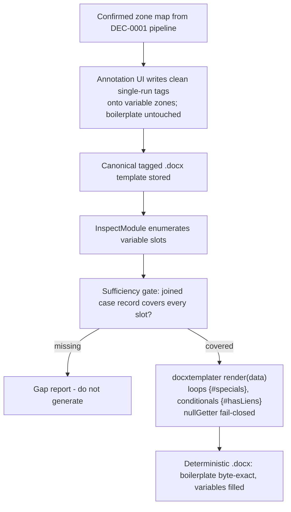

# DEC-0002: Docx Persistence Substrate

> Single-decision Decision Group covering the markup in which the confirmed template zone map is persisted and filled.

- **File created**: 2026-06-22
- **Last updated**: 2026-06-22
- **Tags (group)**: persistence-substrate, docx, template-fill

## Shared Context

[[DEC-0001-template-zone-detection|DEC-0001#D1]] (accepted) chose the hybrid zone-detection pipeline — LLM pre-labels zones, an attorney confirms the boilerplate-verbatim vs variable-populated boundary once in a custom annotation UI, and the confirmed map is **persisted as in-OOXML markup** so every later fill is deterministic and lossless. DEC-0001 explicitly **deferred which markup** to persist into (Word content controls vs delimiter tags) and the docx fill library to a follow-on decision — this one.

Constraints carried in: boilerplate must remain **byte-exact**; variable substitution must be **deterministic**; the substrate must express **loops** (the itemised specials table) and **conditionals** (optional §7 clauses); it must **enumerate variable slots** to feed the input-contract sufficiency gate ([[../../knowledge/concepts/demand-letter-input-contract.md|Demand Letter Input Contract]]); and it must fit a **TypeScript/React/Node.js/AWS Lambda** stack. Crucially, the annotation UI writes the markup **programmatically**, not by hand in Word.

Research for this decision: `raw/research/docx-persistence-substrate/index.md` (+ `sources.md`). Concept context: [[../../knowledge/concepts/docx-zone-detection-pipeline.md|Docx Zone-Detection Pipeline]], tool: [[../../knowledge/entities/tools/docxtemplater.md|docxtemplater]].

---

## D1. Persist the zone map as delimiter tags filled by docxtemplater

- **Status**: accepted
- **Date**: 2026-06-22
- **Deciders**: David Taylor
- **Consulted**: —
- **Informed**: —
- **Supersedes**: none
- **Tags**: persistence-substrate, docx, template-fill

### Context (decision-specific)

Two substrates persist the confirmed zone map inside the `.docx`: **delimiter/placeholder tags** (`{tag}`, filled by docxtemplater/docxtpl) and **Word content controls / Structured Document Tags (SDTs)** (with a sub-variant binding SDTs to a custom XML part). Both are OOXML-native and formatting-lossless; the differentiator is the _programmatic fill story_ in a Node/TS serverless stack and how each handles the Donahue letter's loops, conditionals, and slot enumeration. Because the DEC-0001 annotation UI authors the markup programmatically, the usual SDT advantage (native in-Word authoring) does not apply, and the usual delimiter-tag pitfall (Word splitting hand-typed tags across runs) is avoided.

### Decision Drivers

| #   | Driver                                      | Why it matters                                                                                             |
| --- | ------------------------------------------- | ---------------------------------------------------------------------------------------------------------- |
| 1   | Node/TS-native, serverless-friendly fill    | Stack is TS/React/Node/AWS Lambda; a .NET bridge or paid external API for the core fill path is a poor fit |
| 2   | Must express loops + conditionals           | Specials table = loop; optional §7 clauses (e.g. liens) = conditional; not flat fields                     |
| 3   | Must enumerate variable slots               | The input-contract sufficiency gate needs the template's variable list to emit a gap report                |
| 4   | Boilerplate byte-exact + deterministic fill | Malpractice risk; the engine must touch only variable spans                                                |
| 5   | Programmatically authorable markup          | The annotation UI writes the markup onto confirmed zones; manual Word authoring is not the path            |
| 6   | Low dependency / maintenance risk           | One-week build; favor mature OSS over commercial or hand-rolled OOXML                                      |

### Considered Options

| Option                                | One-line summary                                                                |
| ------------------------------------- | ------------------------------------------------------------------------------- |
| **A. Delimiter tags (docxtemplater)** | `{tag}` placeholders filled inside OOXML by docxtemplater OSS core              |
| **B. Content controls / SDTs**        | Native `<w:sdt>` controls filled programmatically (Aspose or hand-rolled OOXML) |
| **C. SDT + custom XML data binding**  | SDTs bound to a custom XML part; fill the XML island and Word reflects it       |

### Option Comparison

| Criterion                              | A. Delimiter tags                                   | B. Content controls (SDT)            | C. SDT + custom XML binding |
| -------------------------------------- | --------------------------------------------------- | ------------------------------------ | --------------------------- |
| Driver 1 — Node/TS serverless fit      | ✅ (docxtemplater, docx-templates, easy-template-x) | ❌ (Aspose commercial / hand-rolled) | ⚠️ (thin OSS)               |
| Driver 2 — loops + conditionals        | ✅ native (`{#}`, `{^}`, row loops)                 | ⚠️ manual node cloning               | ⚠️ XML-driven, manual       |
| Driver 3 — slot enumeration            | ✅ InspectModule                                    | ⚠️ custom SDT walk                   | ⚠️ read XML schema          |
| Driver 4 — byte-exact + deterministic  | ✅ (only tags touched)                              | ✅ (only control content)            | ✅                          |
| Driver 5 — programmatically authorable | ✅ app writes clean single-run tags                 | ✅ app inserts SDT nodes             | ⚠️ insert SDT + author XML  |
| Driver 6 — dependency/maintenance      | ✅ OSS core                                         | ❌ commercial / high-effort          | ⚠️ med–high                 |
| Implementation cost                    | Low–Med                                             | High                                 | High                        |
| Reversibility                          | Med                                                 | Med                                  | Med                         |

### Trade-off Detail per Option

#### Option A: Delimiter tags (docxtemplater)

| Aspect    | Assessment                                                                                                                                                                                                              |
| --------- | ----------------------------------------------------------------------------------------------------------------------------------------------------------------------------------------------------------------------- |
| Pros      | Mature Node/browser OSS; native loops/conditionals; `nullGetter` fail-closed; structured error schema refuses corrupt output; InspectModule enumerates slots for the sufficiency gate; React/Next.js integration guides |
| Cons      | Raw `{tags}` are ugly if a human hand-edits the docx; some advanced features (HTML/image) sit behind paid modules                                                                                                       |
| Risks     | Split-run/"unopened tag" corruption when tags are hand-typed in Word — mitigated because the annotation UI writes clean single-run tags programmatically                                                                |
| Exit cost | Medium — tags are visible in the docx; migrating to SDTs later is a bounded transform of a known zone map                                                                                                               |

#### Option B: Content controls / SDTs

| Aspect    | Assessment                                                                                                                                                                        |
| --------- | --------------------------------------------------------------------------------------------------------------------------------------------------------------------------------- |
| Pros      | First-class Word objects; machine-readable boundaries with alias/tag; remain editable as controls in Word; lossless formatting                                                    |
| Cons      | Programmatic _filling_ in Node needs Aspose (commercial, .NET-bridged) or hand-rolled OOXML; loops/conditionals are manual node manipulation; no built-in slot-enumeration helper |
| Risks     | Commercial dependency cost/licensing, or high-effort custom OOXML code with its own corruption risks                                                                              |
| Exit cost | Medium — native objects, but the fill code is bespoke                                                                                                                             |

#### Option C: SDT + custom XML data binding

| Aspect    | Assessment                                                                                            |
| --------- | ----------------------------------------------------------------------------------------------------- |
| Pros      | Clean separation of data island from document; Word reflects bound XML automatically; lossless        |
| Cons      | Most complex option; thin OSS tooling in Node; requires authoring both SDTs and the custom XML schema |
| Risks     | Highest build cost for no advantage over A given a headless, app-driven fill pipeline                 |
| Exit cost | Medium–High — two coupled artifacts (controls + XML) to migrate                                       |

### Decision Outcome

**Chosen option**: **Option A — Delimiter tags filled by docxtemplater**, because it is the only substrate that is simultaneously Node/TS-serverless-native (Driver 1) _and_ natively expresses the loops, conditionals, and slot enumeration the letter and sufficiency gate require (Drivers 2–3), while DEC-0001's programmatic annotation UI removes docxtemplater's one real fragility (hand-typed split-run tags) and nullifies SDTs' one real advantage (native Word authoring).

### Decision Flow

### Consequences

| Type         | Consequence                                                                                                                                 |
| ------------ | ------------------------------------------------------------------------------------------------------------------------------------------- |
| ✅ Positive  | Node/TS-native, serverless-friendly fill with no commercial dependency on the core path                                                     |
| ✅ Positive  | Loops, conditionals, fail-closed `nullGetter`, and InspectModule slot-enumeration come for free and wire directly into the sufficiency gate |
| ✅ Positive  | Boilerplate byte-exact by construction (never inside a tag); deterministic output                                                           |
| ⚠️ Negative  | Raw `{tags}` are not human-friendly if someone opens the template in Word — mitigated since authoring is app-side                           |
| ⚠️ Negative  | Advanced HTML/image insertion may require paid docxtemplater modules                                                                        |
| 🔁 Follow-up | Task: docx tag-writing module — annotation UI inserts clean single-run tags onto confirmed zones                                            |
| 🔁 Follow-up | Task: fill engine — docxtemplater render + `nullGetter` fail-closed + InspectModule feeding the sufficiency gate                            |
| 🔁 Follow-up | Define the canonical tag vocabulary mapped to the input-contract field schema                                                               |

### Validation

| Signal                                                      | Threshold                                                        | When measured                               |
| ----------------------------------------------------------- | ---------------------------------------------------------------- | ------------------------------------------- |
| Boilerplate bytes altered vs source template                | 0 (byte-exact diff outside tag spans)                            | Per generation, from first integration test |
| Generation proceeds with an uncovered variable slot         | 0 (sufficiency gate fails closed via InspectModule + nullGetter) | Per generation                              |
| Template activated with a malformed tag (unopened/unclosed) | 0 (InspectModule validation gate before activation)              | Per template onboarding                     |

### Links

- Related decisions: [[DEC-0001-template-zone-detection|DEC-0001#D1: Template Zone-Detection Strategy]] (defers this choice)
- Related concepts: [[../../knowledge/concepts/docx-zone-detection-pipeline.md|Docx Zone-Detection Pipeline]], [[../../knowledge/concepts/demand-letter-input-contract.md|Demand Letter Input Contract]], [[../../knowledge/concepts/template-driven-generation.md|Template-Driven Generation]]
- Tool: [[../../knowledge/entities/tools/docxtemplater.md|docxtemplater]]
- Research: `raw/research/docx-persistence-substrate/index.md`
- Source task(s): _(none yet — `/task-add` after finalize)_
