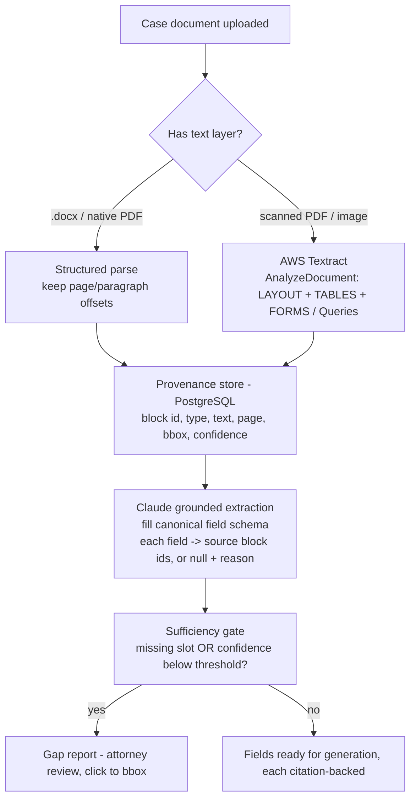
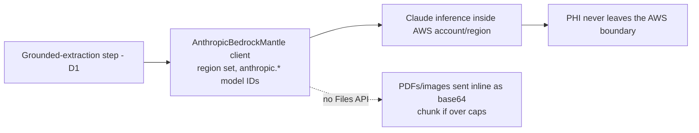

# DEC-0003: Source-Document Ingestion & Provenance

> Decision Group covering how the case record is parsed into provenance-bearing fields (D1) and where Claude inference runs for PHI (D2).

- **File created**: 2026-06-22
- **Last updated**: 2026-06-22
- **Tags (group)**: source-ingestion, provenance, ocr, phi

## Shared Context

This is the **case-record** side of the input contract — the counterpart to the template-side decisions [[DEC-0001-template-zone-detection|DEC-0001#D1]] (zone detection) and [[DEC-0002-docx-persistence-substrate|DEC-0002#D1]] (persistence substrate). The case record arrives as a heterogeneous set of native PDFs, scanned/OCR'd medical records, and `.docx` (intake, police/incident reports, medical records, bills, insurance declarations).

[[../../knowledge/concepts/demand-letter-input-contract.md|The input contract]] makes three demands non-negotiable: **provenance** (every extracted value traceable to its source document and locator — the citation layer), **grounding-only** extraction (no invented fields; absent slots are reported, not filled), and a **sufficiency gate** that can see per-field provenance to emit a gap report. The PRD fixes the stack as **TypeScript/React/Node.js/AWS Lambda/PostgreSQL** with **Claude** preferred (Anthropic API or AWS Bedrock), making **Textract** and **Bedrock** first-class options.

Research for this decision: `raw/research/source-document-ingestion-provenance/index.md` (+ `sources.md`).

---

## D1. Adopt a hybrid Textract → Claude ingestion pipeline with bbox-level provenance

- **Status**: accepted
- **Date**: 2026-06-22
- **Deciders**: David Taylor
- **Consulted**: —
- **Informed**: —
- **Supersedes**: none
- **Tags**: source-ingestion, provenance, ocr

### Context (decision-specific)

Four approaches can turn the case record into provenance-bearing fields: **(1) AWS Textract** (Layout + Queries) for locators only; **(2) OSS OCR** (pdfplumber/unstructured + Tesseract) self-hosted; **(3) Claude-native** PDF + Citations, one-stage; **(4) hybrid** — Textract for layout/locators, then Claude for grounded field extraction. Textract returns per-element **bounding-box + page + confidence**; Claude's Citations feature returns **page-level** locators only and is **incompatible with structured-output schemas** (`output_config.format` → 400). The dominant production IDP pattern is "OCR extraction layer → LLM downstream," which is exactly the hybrid.

### Decision Drivers

| #   | Driver                                       | Why it matters                                                                                            |
| --- | -------------------------------------------- | --------------------------------------------------------------------------------------------------------- |
| 1   | Per-field provenance, as precise as possible | Citation layer + attorney verification; bbox beats page-level for a single diagnosis line or specials row |
| 2   | Grounding-only, schema-shaped extraction     | Must emit the canonical field schema with no invented values; absent slots → gap report                   |
| 3   | Accuracy on messy scanned medical records    | Medical records are often low-quality scans; malpractice risk on misread figures/diagnoses                |
| 4   | Handle native PDF, scanned PDF, and .docx    | Heterogeneous inputs; OCR-ing native text wastes money and loses fidelity                                 |
| 5   | Confidence signal into the sufficiency gate  | Low-confidence extractions must route to attorney review, not silent acceptance                           |
| 6   | AWS-stack fit, bounded build/ops cost        | TS/Node/Lambda/Postgres; prefer managed over self-run OCR for a one-week build                            |

### Considered Options

| Option                                  | One-line summary                                                                                 |
| --------------------------------------- | ------------------------------------------------------------------------------------------------ |
| **1. AWS Textract only**                | Layout + Queries give bbox/page locators and raw blocks; no semantic field extraction            |
| **2. OSS OCR (Tesseract + pdfplumber)** | Self-hosted parse/OCR; cheapest runtime, highest ops burden, weakest on messy scans              |
| **3. Claude-native (PDF + Citations)**  | One stage; grounding-only by construction; page-level provenance; no schema + citations together |
| **4. Hybrid (Textract → Claude)**       | Textract locators + Claude grounded extraction; bbox-precise, schema-shaped                      |

### Option Comparison

| Criterion                       | 1. Textract only   | 2. OSS OCR          | 3. Claude-native      | 4. Hybrid                  |
| ------------------------------- | ------------------ | ------------------- | --------------------- | -------------------------- |
| Driver 1 — provenance precision | ✅ bbox            | ⚠️ bbox (hOCR)      | ⚠️ page only          | ✅ bbox                    |
| Driver 2 — grounding + schema   | ❌ no extraction   | ❌ no extraction    | ⚠️ not with citations | ✅ grounds to block ids    |
| Driver 3 — messy scans          | ✅                 | ⚠️ Tesseract weaker | ✅ vision             | ✅ strongest               |
| Driver 4 — native/scanned/.docx | overkill on native | works               | ✅ direct             | branch: skip OCR on native |
| Driver 5 — confidence signal    | ✅                 | ⚠️ partial          | ❌                    | ✅                         |
| Driver 6 — AWS fit / build cost | ✅ managed         | ❌ high ops         | ✅ low                | ⚠️ two stages              |
| Implementation cost             | Low                | High                | Low                   | Med–High                   |
| Reversibility                   | Easy               | Med                 | Easy                  | Med                        |

### Trade-off Detail per Option

#### Option 1: AWS Textract only

| Aspect    | Assessment                                                                                                            |
| --------- | --------------------------------------------------------------------------------------------------------------------- |
| Pros      | Managed; bbox + page + confidence per element; Layout + Queries; strong on scanned forms/tables                       |
| Cons      | No semantic field extraction — you hand-map blocks to the schema or run a Query per field; no reasoning/normalization |
| Risks     | Brittle field mapping; Queries don't cover narrative synthesis (medical narrative)                                    |
| Exit cost | Easy — becomes the locator stage of the hybrid                                                                        |

#### Option 2: OSS OCR (Tesseract + pdfplumber)

| Aspect    | Assessment                                                                                                                                          |
| --------- | --------------------------------------------------------------------------------------------------------------------------------------------------- |
| Pros      | Cheapest runtime; fully in-house (PHI never leaves infra); bbox via hOCR                                                                            |
| Cons      | Tesseract weaker on messy/cursive medical scans; highest build + operational burden (run/scale/queue OCR yourself); still needs an extraction layer |
| Risks     | Accuracy regressions on the exact documents that matter most (scanned records)                                                                      |
| Exit cost | Med — replace with Textract as the locator stage                                                                                                    |

#### Option 3: Claude-native (PDF + Citations)

| Aspect    | Assessment                                                                                                                                                                     |
| --------- | ------------------------------------------------------------------------------------------------------------------------------------------------------------------------------ |
| Pros      | One stage; native PDF (32MB/600pg, no beta); Citations enforce grounding-only with page locators; cheapest path to a working draft                                             |
| Cons      | Provenance is **page-level only**; Citations are **incompatible with `output_config.format`** — can't emit schema-validated JSON and citations from one call; image-token cost |
| Risks     | Page-granular citations too coarse for a single specials row; schema/citations workaround adds complexity                                                                      |
| Exit cost | Easy — keep Claude, add Textract grounding underneath to reach the hybrid                                                                                                      |

#### Option 4: Hybrid (Textract → Claude)

| Aspect    | Assessment                                                                                                                                                                                                                 |
| --------- | -------------------------------------------------------------------------------------------------------------------------------------------------------------------------------------------------------------------------- |
| Pros      | bbox-precise per-field provenance **and** schema-shaped grounding-only extraction; confidence into the sufficiency gate; grounds to Textract block ids (sidesteps the citations-vs-schema limit); strongest on messy scans |
| Cons      | Two pipeline stages — highest cost/latency and more build than a single tool                                                                                                                                               |
| Risks     | Stage cost; mitigated by caching deterministic Textract output and using Queries when full Layout isn't needed                                                                                                             |
| Exit cost | Med — degrades to Option 3 (drop Textract) or Option 1 (drop Claude) if priorities change                                                                                                                                  |

### Decision Outcome

**Chosen option**: **Option 4 — Hybrid (Textract → Claude)**, because it is the only approach that delivers **bbox-precise per-field provenance** (Driver 1) _and_ **schema-shaped, grounding-only extraction** (Driver 2) at once — the two things the input contract makes non-negotiable — while the Textract grounding layer removes Claude-native's page-level limit and its citations-vs-schema incompatibility.

### Decision Flow

### Consequences

| Type         | Consequence                                                                                       |
| ------------ | ------------------------------------------------------------------------------------------------- |
| ✅ Positive  | bbox-precise provenance per field; attorney can click straight to the source rectangle            |
| ✅ Positive  | Schema-shaped, grounding-only extraction with a confidence signal into the sufficiency gate       |
| ✅ Positive  | Type-branching avoids OCR-ing native text (cost + fidelity); Textract output is cacheable         |
| ⚠️ Negative  | Two-stage pipeline — highest cost and latency of the four options                                 |
| ⚠️ Negative  | More build than a single tool (router + provenance store + grounded-extraction prompt)            |
| 🔁 Follow-up | Task: type-branching ingestion router (text-layer detection)                                      |
| 🔁 Follow-up | Task: Textract provenance store (PostgreSQL schema: block id/type/text/page/bbox/confidence)      |
| 🔁 Follow-up | Task: grounded-extraction prompt + canonical field schema, returning per-field block-id citations |
| 🔁 Follow-up | Task: sufficiency-gate / gap-report component (shared with the input contract)                    |

### Validation

| Signal                                                      | Threshold                                                             | When measured                               |
| ----------------------------------------------------------- | --------------------------------------------------------------------- | ------------------------------------------- |
| Extracted fields lacking a source citation                  | 0 (every field carries block id(s) or an explicit attorney-input tag) | Per extraction, from first integration test |
| Generation proceeds with an uncovered / sub-threshold field | 0 (sufficiency gate fails closed)                                     | Per generation                              |
| Textract field confidence routed to attorney review         | 100% of fields below the configured threshold (e.g. < 95%)            | Per document                                |

### Links

- Related decisions: [[DEC-0001-template-zone-detection|DEC-0001#D1: Template Zone-Detection Strategy]], [[DEC-0002-docx-persistence-substrate|DEC-0002#D1: Docx Persistence Substrate]]
- Related concepts: [[../../knowledge/concepts/demand-letter-input-contract.md|Demand Letter Input Contract]], [[../../knowledge/concepts/ai-document-generation.md|AI Document Generation]]
- Coupled decision: D2 (PHI inference posture) below
- Research: `raw/research/source-document-ingestion-provenance/index.md`
- Source task(s): _(none yet — `/task-add` after finalize)_

---

## D2. Run Claude inference on Amazon Bedrock for PHI residency

- **Status**: accepted
- **Date**: 2026-06-22
- **Deciders**: David Taylor
- **Consulted**: —
- **Informed**: —
- **Supersedes**: none
- **Tags**: phi, data-residency, bedrock

### Context (decision-specific)

The case record contains protected health information (medical records, bills, diagnoses). The grounded-extraction step (D1) sends that PHI to Claude, so _where_ Claude runs is a compliance decision. The research surfaced a concrete fork: **Claude on Amazon Bedrock** keeps data in the customer's AWS account/region under AWS's HIPAA-eligible controls + BAA, and **retains PDF input and Citations** — but **lacks the Files API** (PDFs must be sent inline as base64) and Anthropic's **`inference_geo`** data-residency parameter. The **first-party Anthropic API** offers the full surface (Files API, `inference_geo`, automatic prompt caching) but requires a BAA with Anthropic and sends PHI out of the AWS account.

### Decision Drivers

| #   | Driver                                     | Why it matters                                                                 |
| --- | ------------------------------------------ | ------------------------------------------------------------------------------ |
| 1   | PHI stays within a HIPAA-eligible boundary | Medical records are PHI; a breach or improper transfer is a compliance failure |
| 2   | Minimize new BAAs / vendor surface         | A one-week build benefits from fewer compliance agreements to land             |
| 3   | Retain the grounding mechanism             | PDF input + Citations must survive whatever posture is chosen                  |
| 4   | AWS-account data locality                  | The rest of the stack (Lambda, Postgres, Textract) is already in AWS           |

### Considered Options

| Option                                 | One-line summary                                                                                        |
| -------------------------------------- | ------------------------------------------------------------------------------------------------------- |
| **A. Claude on Amazon Bedrock**        | Data stays in-account/in-region under AWS BAA; PDF + Citations retained; no Files API / `inference_geo` |
| **B. First-party Anthropic API (BAA)** | Full surface (Files API, `inference_geo`, auto caching); requires Anthropic BAA; PHI leaves AWS         |

### Option Comparison

| Criterion                             | A. Bedrock                                     | B. First-party (BAA)       |
| ------------------------------------- | ---------------------------------------------- | -------------------------- |
| Driver 1 — HIPAA boundary             | ✅ AWS-account, AWS BAA                        | ✅ requires Anthropic BAA  |
| Driver 2 — fewer new BAAs             | ✅ (AWS BAA likely already in place)           | ⚠️ new BAA with Anthropic  |
| Driver 3 — PDF + Citations retained   | ✅                                             | ✅                         |
| Driver 4 — data stays in AWS account  | ✅                                             | ❌ leaves to Anthropic API |
| Files API available                   | ❌ (inline base64 only)                        | ✅                         |
| `inference_geo` / auto prompt caching | ❌                                             | ✅                         |
| Implementation cost                   | Low (Mantle client, `anthropic.`-prefixed IDs) | Low                        |
| Reversibility                         | Med (swap client + model IDs)                  | Med                        |

### Trade-off Detail per Option

#### Option A: Claude on Amazon Bedrock

| Aspect    | Assessment                                                                                                                                                                  |
| --------- | --------------------------------------------------------------------------------------------------------------------------------------------------------------------------- |
| Pros      | PHI stays in the AWS account/region under AWS's HIPAA controls; one fewer external vendor for PHI; PDF + Citations both available; co-located with Textract/Lambda/Postgres |
| Cons      | No Files API → PDFs/images sent inline as base64 (32MB / page caps); no `inference_geo`; no automatic prompt caching                                                        |
| Risks     | Inline-base64 size limits on very large records → must chunk                                                                                                                |
| Exit cost | Med — switch to first-party by swapping the client class and dropping the `anthropic.` model-ID prefix                                                                      |

#### Option B: First-party Anthropic API (BAA)

| Aspect    | Assessment                                                                                                                                 |
| --------- | ------------------------------------------------------------------------------------------------------------------------------------------ |
| Pros      | Full feature surface — Files API (upload once, reference by id), `inference_geo` data residency, automatic prompt caching, same-day parity |
| Cons      | Requires a signed BAA with Anthropic; PHI leaves the AWS account to Anthropic's API                                                        |
| Risks     | BAA negotiation can delay a one-week build; broader data-egress surface to assess                                                          |
| Exit cost | Med — switch to Bedrock client                                                                                                             |

### Decision Outcome

**Chosen option**: **Option A — Claude on Amazon Bedrock**, because it keeps PHI inside the existing AWS account/region under AWS's HIPAA-eligible controls (Driver 1, 4) without standing up a new BAA with Anthropic (Driver 2), while retaining the PDF + Citations grounding mechanism D1 depends on (Driver 3); the lost Files API and `inference_geo` are acceptable — PDFs go inline as base64.

### Decision Flow

### Consequences

| Type         | Consequence                                                                                                                                              |
| ------------ | -------------------------------------------------------------------------------------------------------------------------------------------------------- |
| ✅ Positive  | PHI stays within the AWS account/region under AWS's HIPAA-eligible controls; no new Anthropic BAA needed                                                 |
| ✅ Positive  | PDF input + Citations retained; co-located with Textract/Lambda/Postgres                                                                                 |
| ⚠️ Negative  | No Files API — PDFs/images must be sent inline as base64 within the 32MB / page limits                                                                   |
| ⚠️ Negative  | No `inference_geo` and no automatic prompt caching on Bedrock                                                                                            |
| 🔁 Follow-up | Task: Bedrock integration via the `AnthropicBedrockMantle` client (region config, `anthropic.`-prefixed model IDs), inline-base64 PDF path with chunking |

### Validation

| Signal                                                       | Threshold                                                    | When measured                     |
| ------------------------------------------------------------ | ------------------------------------------------------------ | --------------------------------- |
| PHI-bearing requests leaving the AWS account/region          | 0                                                            | Continuous (network/egress audit) |
| Documents exceeding the inline-base64 cap that fail silently | 0 (oversized records chunked or rejected with a clear error) | Per document                      |

### Links

- Related decisions: depends on [[#D1. Adopt a hybrid Textract → Claude ingestion pipeline with bbox-level provenance|DEC-0003#D1]] (the pipeline that sends PHI to Claude)
- Related concepts: [[../../knowledge/concepts/demand-letter-input-contract.md|Demand Letter Input Contract]]
- Reference: claude-api skill — `shared/platform-availability.md` (Bedrock feature matrix), Provider Clients (Amazon Bedrock)
- Research: `raw/research/source-document-ingestion-provenance/index.md`
- Source task(s): _(none yet — `/task-add` after finalize)_
