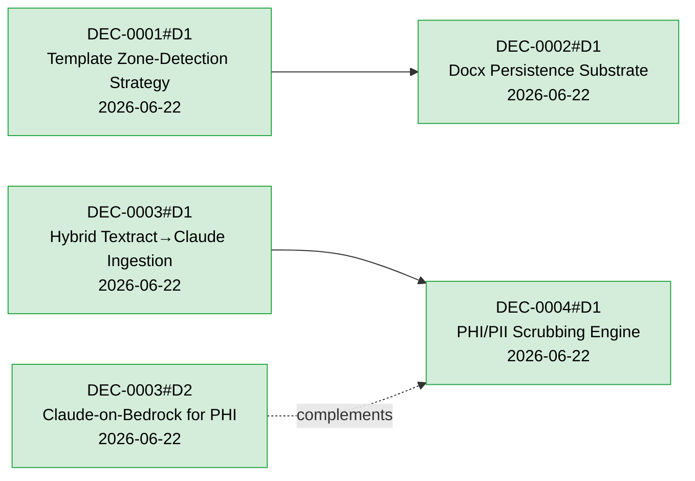

# Decisions Lifecycle

Architecture Decision Records. Each file is a **Decision Group** containing one or more `## DM. <title>` decision blocks. ID scheme: **DEC-NNNN** (4-digit, zero-padded) for the group; **DEC-NNNN#DM** for an individual decision (e.g. `DEC-0001#D2`). Filename: `DEC-NNNN-slug.md`.

Active files are **never moved** after creation; per-decision state lives in each block's `status` field. When all decisions in a group are `accepted` or `superseded`, the group may be moved to [`archive/`](archive/) by `/wiki-archive`. The active set is tracked in [`index.md`](index.md) — a group stays listed while at least one of its decisions is `proposed`.

## Frontmatter / per-decision schema

Group frontmatter:

| Key | Required | Notes |
|-----|----------|-------|
| `id` | yes | `DEC-NNNN` |
| `title` | yes | decision-group title |
| `created` / `updated` | yes | `YYYY-MM-DD` |
| `tags` | yes | umbrella tags for the group |

Per-decision block (`## D1.`, `## D2.` …) metadata:

| Field | Required | Notes |
|-------|----------|-------|
| Status | yes | `proposed \| accepted \| superseded` |
| Date | yes | `YYYY-MM-DD` |
| Deciders | yes | who decided |
| Consulted / Informed | no | E-C-A-D-R inputs |
| Supersedes | no | `DEC-NNNN#DM \| none` |
| Tags | yes | decision-area tags |

## Status transitions

```
proposed ──▶ accepted ──▶ superseded
```

- **proposed** — drafted in a Decision Group (`/decision-create`); comparison tables + mermaid flowchart, no commitment.
- **accepted** — finalized per-decision via `/decision-finalize` after an E-C-A-D-R audit. Siblings in the same group are untouched.
- **superseded** — replaced by a later accepted decision; the new block sets `Supersedes:` and the old block is marked `superseded by DEC-NNNN#DM`. Both blocks updated atomically; old block preserved.

---

## Decision Index

| File | Decision | Title | Decision Area | Status | Date | Deciders | Supersedes | Superseded By |
|------|----------|-------|---------------|--------|------|----------|------------|---------------|
| [DEC-0001-template-zone-detection.md](archive/DEC-0001-template-zone-detection.md) | D1 | Adopt a hybrid LLM-seeded, human-confirmed, deterministic-markup zone-detection pipeline | template-ingestion, zone-detection | accepted | 2026-06-22 | David Taylor | — | — |
| [DEC-0002-docx-persistence-substrate.md](archive/DEC-0002-docx-persistence-substrate.md) | D1 | Persist the zone map as delimiter tags filled by docxtemplater | persistence-substrate, template-fill | accepted | 2026-06-22 | David Taylor | — | — |
| [DEC-0003-source-document-ingestion.md](archive/DEC-0003-source-document-ingestion.md) | D1 | Adopt a hybrid Textract → Claude ingestion pipeline with bbox-level provenance | source-ingestion, provenance, ocr | accepted | 2026-06-22 | David Taylor | — | — |
| [DEC-0003-source-document-ingestion.md](archive/DEC-0003-source-document-ingestion.md) | D2 | Run Claude inference on Amazon Bedrock for PHI residency | phi, data-residency, bedrock | accepted | 2026-06-22 | David Taylor | — | — |
| [DEC-0004-phi-pii-scrubbing-engine.md](DEC-0004-phi-pii-scrubbing-engine.md) | D1 | Use AWS Comprehend Medical + Amazon Comprehend with a custom redaction step | phi, pii, de-identification, redaction | accepted | 2026-06-22 | David Taylor | — | — |

---

## Relationship Graph


